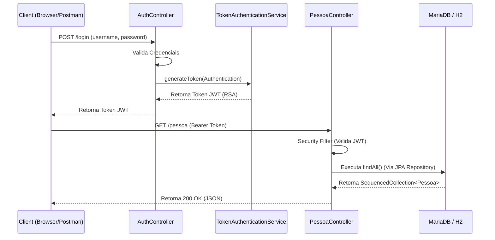

# Springboot API 🚀

Este projeto é uma **API REST moderna e de alto desempenho**, escrita em **Java 25 (LTS)** utilizando o ecossistema **Spring Boot 4.1.0**. O objetivo desta API é demonstrar as melhores práticas em desenvolvimento back-end, incluindo autenticação baseada em JWT, testes robustos automatizados com relatórios de cobertura (JaCoCo) e deployment simplificado em contêineres Docker usando Multi-stage builds.

## Índice
* [Sobre o Projeto](#sobre-o-projeto)
* [Arquitetura](#arquitetura)
* [Como Executar (Docker)](#como-executar-docker)
* [Como Desenvolver (Local)](#como-desenvolver-local)
* [Testes de Cobertura (JaCoCo)](#testes-de-cobertura-jacoco)
* [Swagger & Automação de Requests](#swagger--automação-de-requests)
* [Teste de Carga (JMeter)](#teste-de-carga-jmeter)
* [Equipe](#equipe)

---

## Sobre o Projeto

A API gerencia informações de `Pessoa` através de um CRUD seguro. 

**Características Principais:**
- **Tecnologia Ponta:** Java 25 (Virtual Threads ativas + `SequencedCollections`) e Spring Boot 4.1.0.
- **Segurança (JWT):** Geração e validação de tokens JWT (RSA assinados) via `AuthController` e `TokenAuthenticationService`.
- **Validação e Banco de Dados:** JPA / Hibernate para banco de dados, com validação de entidade estrita provida pelo `hibernate-validator` (Jakarta EE), garantindo integridade dos dados com anotações como `@NotBlank` e `@Size`.
- **Testes Abrangentes:** Testes unitários focados na confiabilidade de todos os endpoints (`PessoaControllerTest`, `AuthControllerTest`), cobrindo desde o caminho feliz até cenários de falha (credenciais incorretas, validação de payload).
- **Docker Multi-stage Build:** Um processo isolado e seguro no Docker que compreende etapas de base, testes automáticos, construção (com um JRE minimalista via `jlink`) e imagem leve final (`runtime`).

---

## Arquitetura

O diagrama abaixo detalha o fluxo de comunicação entre os clientes (Postman/Newman), a camada de segurança da API e a interação dos componentes internos para resolução da lógica de negócio.



---

## Como Executar (Docker)

[![asciicast]](https://asciinema.org/a/694412)

Você só precisa do [Docker](https://docs.docker.com/get-docker/) instalado. Não é necessário ter o JDK localmente para construir a aplicação, pois tudo é isolado através do `Dockerfile`.

Para provisionar o banco de dados (MariaDB) e rodar a aplicação:
```sh
docker-compose up --build
```
A API estará pronta para receber requisições em `http://localhost:8080`.

*(Veja as configurações de banco em `docker-compose.yml`)*.

---

## Interface de Administração (Spring Boot Admin)

O projeto inclui o **Spring Boot Admin** para monitoramento e gerenciamento da aplicação. Através desta interface, você pode visualizar detalhes sobre a saúde da aplicação, métricas, variáveis de ambiente, logs e, agora, a lista de dependências e a árvore de dependências (SBOM).

Para acessar a interface administrativa:

1.  **URL:** `http://localhost:8080/admin`
2.  **Usuário:** `admin`
3.  **Senha:** `admin`

*As abas de dependências (`Dependencies > Dependencies` e `Dependencies > Dependencies Trees`) já estão configuradas e preenchidas via integração com o `cyclonedx-maven-plugin`.*

---

## Como Desenvolver (Local)

Para rodar a aplicação no seu ambiente (necessário Java 25 configurado, de preferência usando o [SDKMAN](https://sdkman.io/)):

1.  Baixe e compile o projeto (pulando testes no primeiro empacotamento, se preferir):
    ```sh
    ./mvnw clean package -DskipTests
    ```
2. Inicie a aplicação via Maven (ou rode o artefato `target/springbootapi-0.0.1-SNAPSHOT.jar`):
    ```sh
    ./mvnw spring-boot:run
    ```

---

## Testes e Cobertura (JaCoCo)

Os testes podem ser rodados sem depender do banco de dados na infra (utiliza-se H2 em memória). A cobertura de código atual atende as classes principais e componentes de autenticação.

Para executar localmente e gerar os relatórios do **JaCoCo**:
```sh
./mvnw clean test jacoco:report
```

O relatório em formato HTML ficará disponível no seu diretório `target`:
```
target/site/jacoco/index.html
```

*(No Docker, implementamos o **Test Stage**: O projeto possui um target chamado `test` no Dockerfile que quebra o build automaticamente se os testes falharem)*.
```sh
docker build --target test -t springbootapi-test .
```

---

## Swagger & Automação de Requests

### Swagger UI
A API descreve-se automaticamente na rota padrão do Swagger:
```
http://localhost:8080/swagger-ui/index.html
```
Na documentação você pode visualizar todas as rotas de `Pessoa` e o modelo de dados de resposta.

### Automação via Newman (Postman)
Para simular testes E2E (End-to-End) robustos e automatizados, a coleção do Postman foi aprimorada para validar não apenas o fluxo principal de sucesso (200 OK), mas também os fluxos de exceção, como acesso não autorizado (401), entidade não encontrada (404) e validações de dados inválidos (400 Bad Request). 

Para rodar os fluxos automáticos da coleção com o Newman no Docker e validar a API conteinerizada:
```sh
docker-compose run --rm newman
```
Os relatórios finais da execução de ponta-a-ponta ficarão registrados na pasta `newman/tests/newman/`.

---

## Teste de Carga (JMeter)

O projeto inclui uma suíte de testes de carga automatizada desenvolvida no **Apache JMeter 5.5**, localizada em `jmeter/springbootapi.jmx`. Este teste foi projetado para avaliar a performance e resiliência da API sob concorrência e alto fluxo de requisições, tirando proveito máximo das **Virtual Threads do Java 25**.

### Cenários de Teste Cobertos
O plano de teste simula o ciclo de vida completo de uso da API por múltiplos usuários virtuais simultâneos:
1. **Autenticação:** Login com sucesso (POST `/login`) para obtenção do token JWT e tentativa de login inválido (POST `/login` - Falha) validando a resposta 401 Unauthorized.
2. **Observabilidade:** Acesso contínuo aos endpoints do Spring Actuator (`GET /actuator/health`, `GET /actuator/sbom` e `GET /actuator/sbom/application`).
3. **Fluxo Completo de CRUD (Pessoa) com validações:** 
   - Criação de entidade válida (POST `/pessoa`) extraindo dinamicamente o ID e Nome gerados para uso nas requisições seguintes.
   - Tentativa de criação com dados inválidos (Nome Curto e Longo) validando resposta de erro 400 Bad Request.
   - Busca detalhada de entidade recém-criada (GET `/pessoa/:id`) e busca por ID inexistente (GET `/pessoa/999999` esperando 404 Not Found).
   - Atualização completa de entidade (PUT `/pessoa/:id`) e validações de erro para atualizações inválidas (Nome Curto e Longo).
   - Listagem geral (GET `/pessoa`) com validações de payload.
   - Exclusão lógica da entidade criada (DELETE `/pessoa/:id`) e exclusão de ID inexistente (DELETE `/pessoa/999999` esperando 404 Not Found).
4. **Segurança de Acesso:** Acesso não autenticado (GET `/pessoa` - Sem Auth) para validar a correta rejeição com status 401 Unauthorized ou 403 Forbidden.

### Como Executar os Testes de Carga

Os testes de carga rodam de forma totalmente conteinerizada via Docker Compose, utilizando a imagem oficial `justb4/jmeter:5.5`. O serviço está configurado para iniciar automaticamente de forma encadeada após o sucesso dos testes do Newman (E2E).

Para iniciar todo o pipeline de testes (App -> DB -> Newman -> JMeter):
```sh
docker-compose up --build
```

Caso queira rodar **apenas** o serviço do JMeter de forma isolada (certificando-se de que a aplicação `app` está em execução):
```sh
docker-compose run --rm jmeter
```

### Customização dos Parâmetros de Carga
Você pode customizar o comportamento do teste passando variáveis de ambiente na execução ou alterando as definições diretamente nos parâmetros passados para o JMeter no arquivo `docker-compose.yml`. Por padrão, estão configurados:
- `threads`: Quantidade de usuários virtuais concorrentes (Padrão: `10` via `-Jthreads=10`).
- `rampup`: Tempo de rampa em segundos para subir todas as threads (Padrão: `2` via `-Jrampup=2`).
- `duration`: Tempo total de duração do teste em segundos (Padrão: `30` via `-Jduration=30`).
- `server`: Host do servidor alvo (Padrão: `app` via `-Jserver=app`).
- `port`: Porta do servidor alvo (Padrão: `8080` via `-Jport=8080`).

### Resultados e Relatórios Analíticos
Após o término da execução, o JMeter gera um relatório estático interativo rico em gráficos e métricas de latência (tempo de resposta), vazão (Throughput) e taxas de erro.

- **Logs Brutos e Resultados:** Gravados localmente na pasta `jmeter/` como `results.jtl` e `jmeter.log` (arquivos ignorados pelo Git).
- **Relatório Web (Dashboard HTML):** Gerado na pasta `jmeter/reports/index.html`. 
  - *Dica:* Abra o arquivo `jmeter/reports/index.html` em qualquer navegador para interagir com os gráficos detalhados de desempenho (Over Time, Latencies, Throughput, Hits Per Second, Response Codes, etc.).

---

## Equipe
- **Wladimilson M. Nascimento** *(Autor original e idealização)*
- **Pedro Robson Leão** *(Manutenção, migração e atualização arquitetural)*
