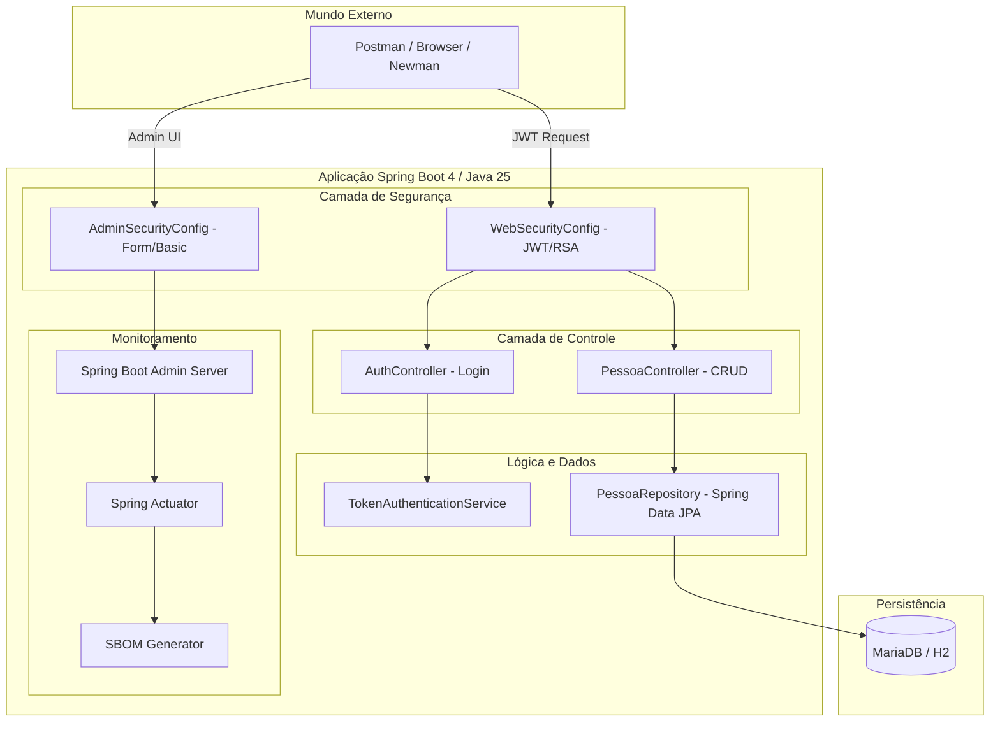
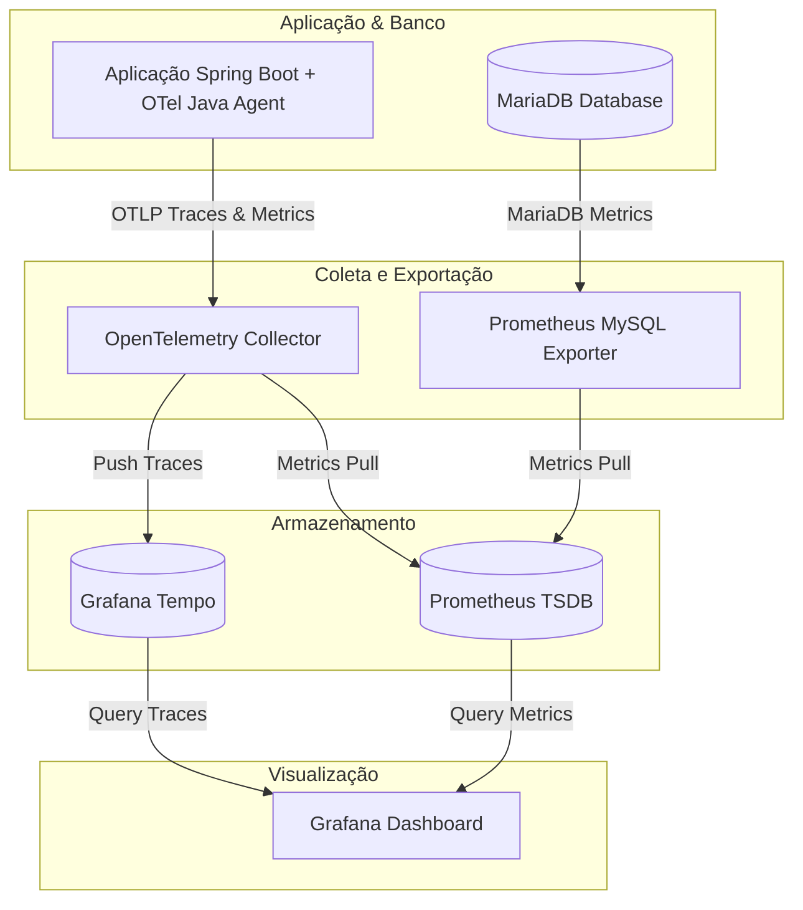

# Guia Técnico de Evolução e Referência - Springboot API 🚀

Este documento serve como uma referência técnica detalhada sobre a evolução recente do projeto, sua arquitetura e diretrizes para reprodução e aprendizado futuro.

---

## 1. Análise da Evolução (Últimos 7 Commits)

O projeto passou por uma modernização significativa, focando em performance, observabilidade e robustez.

### [a96d7ca] e [2890fac] - Modernização para Java 25
*   **O que mudou:** Atualização do JDK para a versão 25 (LTS).
*   **Inovações Técnicas:**
    *   **Virtual Threads:** Ativação do Project Loom para lidar com alto throughput de requisições de forma leve.
    *   **Sequenced Collections:** Uso de interfaces como `SequencedCollection` para garantir ordem previsível nos retornos da API.
    *   **JEP 467:** Adoção de Javadoc em Markdown (`///`) para documentação de código mais legível.
    *   **Docker Multi-stage:** Refatoração do `Dockerfile` para isolar a etapa de testes e gerar uma imagem final minimalista (JRE customizado via `jlink`).

### [20f15f6] - Limpeza e Documentação
*   **O que mudou:** Remoção de entidades não utilizadas (`Usuario`) e refinamento do README.
*   **Impacto:** Melhora na manutenibilidade e redução de ruído no código-fonte.

### [30d0e76] - Observabilidade com Spring Boot Admin
*   **O que mudou:** Integração do servidor e cliente do Spring Boot Admin.
*   **Detalhe de Segurança:** Implementação do `AdminSecurityConfig`, permitindo que a interface administrativa tenha seu próprio fluxo de autenticação (Base/Form Login) separado da API (JWT).

### [dd23b1f] - Robustez e Validação
*   **O que mudou:** Introdução de validações de Bean (`jakarta.validation`).
*   **Impacto:** A entidade `Pessoa` agora valida campos obrigatórios e tamanhos, prevenindo dados inconsistentes no banco de dados. Testes unitários foram expandidos para cobrir cenários de erro (400, 401, 404).

### [4f7094a] - Segurança e SBOM
*   **O que mudou:** Configuração do `cyclonedx-maven-plugin`.
*   **Impacto:** Geração automática do **SBOM (Software Bill of Materials)**, permitindo auditoria de segurança das dependências diretamente no painel do Spring Boot Admin.

---

## 2. Arquitetura do Sistema

A arquitetura segue o padrão de **Clean Architecture** simplificado, com camadas bem definidas para Segurança, Controle, Negócio e Persistência.



---

## 3. Observações para Reprodução Facilitada

Para replicar este ambiente ou usar como base para novos projetos, atente-se aos seguintes pontos:

### Configuração do Ambiente
1.  **JDK 25:** Essencial para suporte às `Virtual Threads` e sintaxe Markdown no Javadoc.
2.  **Chaves RSA:** O projeto utiliza `private-key.pem` e `public-key.pem` em `src/main/resources/certs/` para assinatura de tokens.
3.  **Docker & Compose:** A forma mais rápida de subir o ecossistema completo (App + DB + Admin).

### Passos para Build e Execução
*   **Via Docker (Recomendado):**
    ```bash
    docker-compose up --build
    ```
*   **Via Maven (Desenvolvimento):**
    ```bash
    ./mvnw spring-boot:run
    ```

### Endpoints Chave para Validação
*   **API Swagger:** `http://localhost:8080/swagger-ui/index.html`
*   **Admin Dashboard:** `http://localhost:8080/admin` (admin/admin)
*   **Health Check:** `http://localhost:8080/actuator/health`

---

## 4. Destaques Técnicos de Aprendizado

*   **Jlink no Docker:** Observe no `Dockerfile` como o `jlink` é usado para reduzir a imagem de ~500MB para ~150MB, incluindo apenas os módulos do JDK necessários.
*   **Segurança Híbrida:** O projeto demonstra como configurar múltiplos `SecurityFilterChain` com ordens diferentes (`@Order`) para tratar API e UI administrativa de formas distintas.
*   **Java Records:** O uso de `records` (como em `LoginRequest`) demonstra a adoção de estruturas de dados imutáveis e concisas, típicas do Java moderno.
*   **Segurança Idiomática:** A implementação utiliza `JwtEncoder` e `JwtDecoder` do ecossistema OAuth2 do Spring Security, abandonando bibliotecas legadas e adotando o padrão de mercado para assinatura RSA.
*   **Virtual Threads:** Configuradas via `application.yaml` com `spring.threads.virtual.enabled=true`, permitindo escalar sem a sobrecarga de threads tradicionais do SO.
*   **SBOM:** A integração do CycloneDX com o Spring Boot Admin é uma funcionalidade avançada de segurança que garante visibilidade total da cadeia de suprimentos de software.

---

## 5. Pilha de Monitoramento de Alta Robustez (OpenTelemetry + Prometheus + Tempo + Grafana)

Para deixar o projeto com um nível de monitoração profissional e extremamente robusto, integramos uma solução completa de observabilidade com o ecossistema OpenTelemetry e Grafana.

### Arquitetura de Observabilidade



### Componentes da Solução

1. **OpenTelemetry Java Agent (`v2.29.0`):** Injetado dinamicamente no runtime do container Alpine. O agente coleta automaticamente métricas da JVM (threads, garbage collection, heap), RED metrics das requisições HTTP (Rate, Errors, Duration) e traces distribuídos detalhados do JDBC e Hibernate, sem alterar sequer uma linha do código Java.
2. **Prometheus MySQL Exporter (`mysqld-exporter`):** Um serviço focado na saúde do banco de dados que expõe métricas de conexões ativas, InnoDB buffer pools, queries executadas e tráfego do MariaDB.
3. **OpenTelemetry Collector (`otel-collector`):** O centralizador de telemetria. Recebe traces e métricas da aplicação via gRPC (porta `4317`), roteia as métricas para o Prometheus e envia os traces de forma assíncrona para o Tempo.
4. **Prometheus TSDB:** Banco de dados de séries temporais que scrapea os dados coletados pelo `otel-collector` e pelo `mysqld-exporter` a cada 5 segundos.
5. **Grafana & Tempo:**
   * **Tempo:** Solução moderna e de alta escala para armazenamento de traces de chamadas (Distributed Tracing).
   * **Grafana:** Painel de controle integrado com provisionamento automático de dados e dois dashboards pré-instalados na inicialização (através do container `init-grafana` que busca as configurações mais atualizadas da Grafana Labs):
     * **JVM OpenTelemetry Dashboard (ID: 18812):** Painel interativo para verificar uso de CPU, classes, memória, latências e concorrência das Virtual Threads.
     * **MySQL Exporter Dashboard (ID: 11323):** Painel profundo com todas as principais variáveis e performance de queries do MariaDB.

### Endpoints da Pilha de Monitoração
*   **Grafana Dashboard:** `http://localhost:3000` (Acesso anônimo automático configurado como Administrador para facilidade de uso)
*   **Prometheus UI:** `http://localhost:9095`
*   **MySQL Exporter Metrics:** `http://localhost:9104/metrics`

---
*Este documento é parte da iniciativa de tornar o código uma referência de excelência técnica.*
