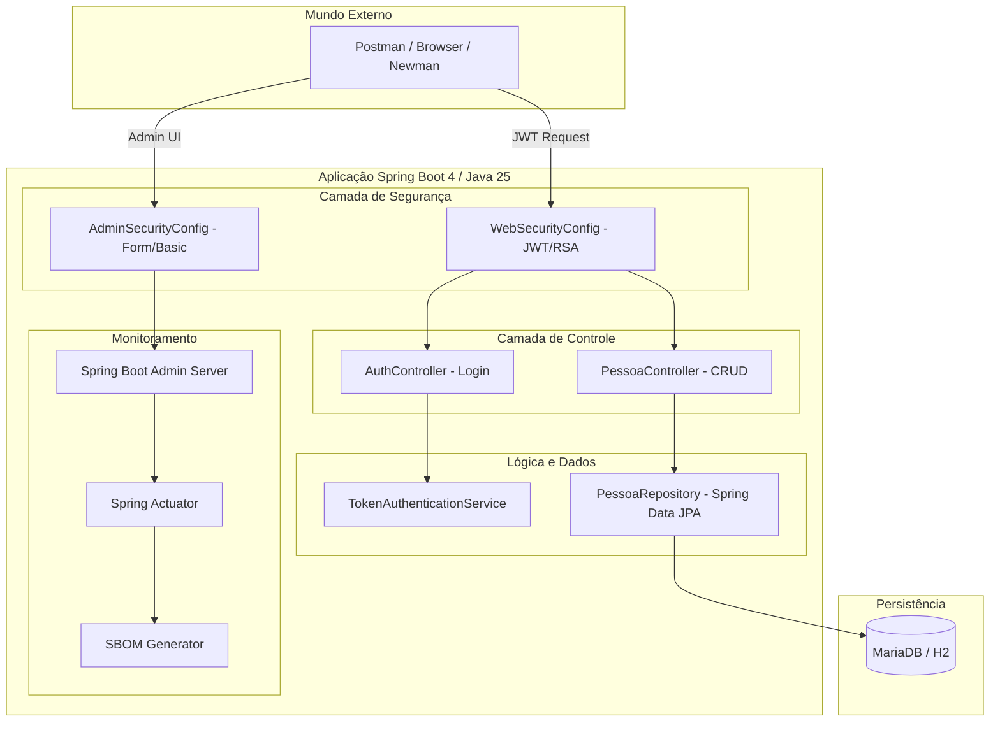

# Guia Técnico de Evolução e Referência - Springboot API 🚀

Este documento serve como uma referência técnica detalhada sobre a evolução recente do projeto, sua arquitetura e diretrizes para reprodução e aprendizado futuro.

---

## 1. Análise da Evolução (Últimos 7 Commits)

O projeto passou por uma modernização significativa, focando em performance, observabilidade e robustez.

### [fa181be] a [d8be892] - Atualização de Dependências para LTS/Estáveis (Julho de 2026)
*   **O que mudou:** Atualização geral de todos os artefatos para suas versões mais recentes.
*   **Destaques Técnicos:**
    *   **Spring Boot 4.1.0:** Atualização do framework core, trazendo melhorias de performance e compatibilidade nativa com Java 25.
    *   **Maven 3.9.16:** Upgrade do Maven Wrapper para resolver avisos de depreciação terminal relacionados à biblioteca `sun.misc.Unsafe` (utilizada pelo Guava).
    *   **CycloneDX 1.5:** Ajuste da versão do esquema do SBOM para 1.5 para resolver avisos de validação de esquemas JSON no plugin CycloneDX.
    *   **Ecossistema Atualizado:** Atualização do Hibernate (7.4.1.Final), MySQL Connector (9.7.0), e bibliotecas de segurança (JJWT 0.13.0).

### [a96d7ca] e [2890fac] - Modernização para Java 25
*   **O que mudou:** Atualização do JDK para a versão 25 (LTS).
*   **Inovações Técnicas:**
    *   **Virtual Threads:** Ativação do Project Loom para lidar com alto throughput de requisições de forma leve.
    *   **Sequenced Collections:** Uso de interfaces como `SequencedCollection` para garantir ordem previsível nos retornos da API.
    *   **JEP 467:** Adoção de Javadoc em Markdown (`///`) para documentação de código mais legível.
    *   **Docker Multi-stage:** Refatoração do `Dockerfile` para isolar a etapa de testes e gerar uma imagem final minimalista (JRE customizado via `jlink`).

### [20f15f6] - Limpeza e Documentação
*   **O que mudou:** Remoção de entidades não utilizadas (`Usuario`) e refinamento do README.
*   **Impacto:** Melhora na manutenibilidade e redução de ruído no código-fonte.

### [30d0e76] - Observabilidade com Spring Boot Admin
*   **O que mudou:** Integração do servidor e cliente do Spring Boot Admin.
*   **Detalhe de Segurança:** Implementação do `AdminSecurityConfig`, permitindo que a interface administrativa tenha seu próprio fluxo de autenticação (Base/Form Login) separado da API (JWT).

### [dd23b1f] - Robustez e Validação
*   **O que mudou:** Introdução de validações de Bean (`jakarta.validation`).
*   **Impacto:** A entidade `Pessoa` agora valida campos obrigatórios e tamanhos, prevenindo dados inconsistentes no banco de dados. Testes unitários foram expandidos para cobrir cenários de erro (400, 401, 404).

### [4f7094a] - Segurança e SBOM
*   **O que mudou:** Configuração do `cyclonedx-maven-plugin`.
*   **Impacto:** Geração automática do **SBOM (Software Bill of Materials)**, permitindo auditoria de segurança das dependências diretamente no painel do Spring Boot Admin.

### [5a2f6eb] - Otimização de Atuadores e Ajustes de Carga do JMeter
*   **O que mudou:** Separação dos atuadores públicos em uma `SecurityFilterChain` dedicada e totalmente stateless (`@Order(1)`), liberação pública da rota `/error` no `WebSecurityConfig` (`@Order(3)`) para evitar o mascaramento de status HTTP reais (como 406 Not Acceptable) com o código 401 Unauthorized de segurança, e adição de cabeçalho `Accept: */*` na requisição do SBOM no teste do JMeter para resolver a incompatibilidade de Content Negotiation.
*   **Impacto:** Resolução completa dos gargalos de negociação de tipos e criação de sessões, **zerando os erros sob carga (0.00% de taxa de erro com 6.179 requisições)** e confirmando a ultra-alta performance das Virtual Threads do Java 25.

---

## 2. Arquitetura do Sistema

A arquitetura segue o padrão de **Clean Architecture** simplificado, com camadas bem definidas para Segurança, Controle, Negócio e Persistência.



---

## 3. Observações para Reprodução Facilitada

Para replicar este ambiente ou usar como base para novos projetos, atente-se aos seguintes pontos:

### Configuração do Ambiente
1.  **JDK 25:** Essencial para suporte às `Virtual Threads` e sintaxe Markdown no Javadoc.
2.  **Chaves RSA:** O projeto utiliza `private-key.pem` e `public-key.pem` em `src/main/resources/certs/` para assinatura de tokens.
3.  **Docker & Compose:** A forma mais rápida de subir o ecossistema completo (App + DB + Admin).

### Passos para Build e Execução
*   **Via Docker (Recomendado):**
    ```bash
    docker-compose up --build
    ```
*   **Via Maven (Desenvolvimento):**
    ```bash
    ./mvnw spring-boot:run
    ```

### Endpoints Chave para Validação
*   **API Swagger:** `http://localhost:8080/swagger-ui/index.html`
*   **Admin Dashboard:** `http://localhost:8080/admin` (admin/admin)
*   **Health Check:** `http://localhost:8080/actuator/health`

---

## 4. Destaques Técnicos de Aprendizado

*   **Jlink no Docker:** Observe no `Dockerfile` como o `jlink` é usado para reduzir a imagem de ~500MB para ~150MB, incluindo apenas os módulos do JDK necessários.
*   **Segurança Híbrida:** O projeto demonstra como configurar múltiplos `SecurityFilterChain` com ordens diferentes (`@Order`) para tratar API e UI administrativa de formas distintas.
*   **Java Records:** O uso de `records` (como em `LoginRequest`) demonstra a adoção de estruturas de dados imutáveis e concisas, típicas do Java moderno.
*   **Segurança Idiomática:** A implementação utiliza `JwtEncoder` e `JwtDecoder` do ecossistema OAuth2 do Spring Security, abandonando bibliotecas legadas e adotando o padrão de mercado para assinatura RSA.
*   **Virtual Threads:** Configuradas via `application.yaml` com `spring.threads.virtual.enabled=true`, permitindo escalar sem a sobrecarga de threads tradicionais do SO.
*   **SBOM:** A integração do CycloneDX com o Spring Boot Admin é uma funcionalidade avançada de segurança que garante visibilidade total da cadeia de suprimentos de software.

---
*Este documento é parte da iniciativa de tornar o código uma referência de excelência técnica.*
